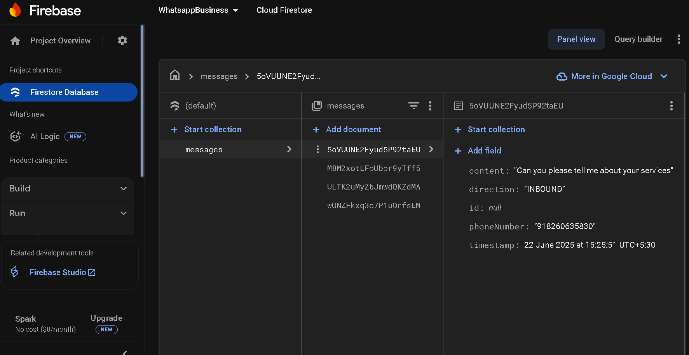
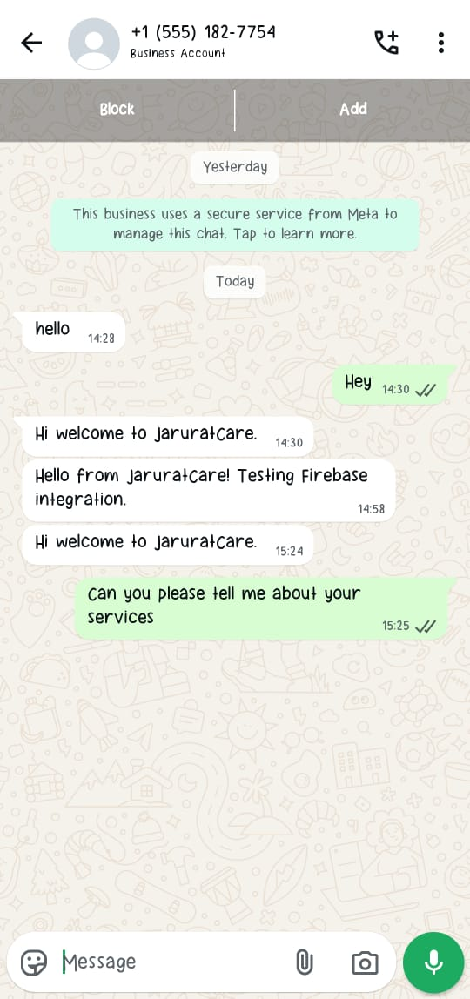
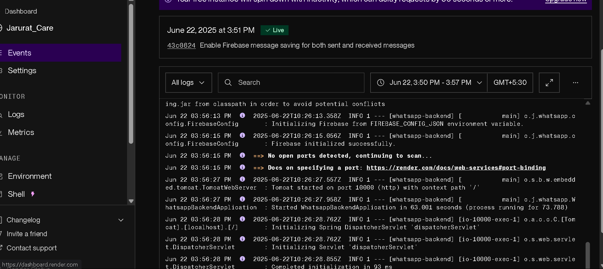

# 🚀 JaruratCare WhatsApp Chatbot

A professional WhatsApp Business API integration built with Java Spring Boot, featuring Firebase integration and deployed on Render. This project demonstrates full-stack backend development capabilities with real-time messaging, data persistence, and production-ready deployment.

## 📋 Table of Contents

- [Overview](#overview)
- [Features](#features)
- [Technology Stack](#technology-stack)
- [Live Demo](#live-demo)
- [API Documentation](#api-documentation)
- [Architecture](#architecture)
- [Setup & Installation](#setup--installation)
- [Usage](#usage)
- [Deployment](#deployment)
- [Project Structure](#project-structure)
- [Contributing](#contributing)
- [License](#license)

## 🎯 Overview

JaruratCare WhatsApp Chatbot is a robust backend service that integrates with Meta's WhatsApp Business API to provide automated messaging capabilities. The system handles both incoming and outgoing messages, stores conversation history in Firebase Firestore, and provides a comprehensive REST API for external integrations.

### Key Highlights
- ✅ **Production Ready**: Live deployment on Render
- ✅ **Real-time Messaging**: WhatsApp Business API integration
- ✅ **Data Persistence**: Firebase Firestore integration
- ✅ **RESTful API**: Complete CRUD operations
- ✅ **Webhook Support**: Real-time message processing
- ✅ **Health Monitoring**: Service status tracking
- ✅ **API Documentation**: Swagger/OpenAPI integration

## 🚀 Features

### Core Functionality
- **Message Sending**: Send WhatsApp messages to any phone number
- **Message Receiving**: Process incoming messages via webhooks
- **Message Storage**: Persistent storage in Firebase Firestore
- **Message Retrieval**: Query messages by phone number
- **Status Tracking**: Monitor message delivery status

### Advanced Features
- **Webhook Verification**: Secure webhook token validation
- **Message Direction Tracking**: INBOUND/OUTBOUND classification
- **Real-time Processing**: Instant message handling
- **Error Handling**: Comprehensive exception management
- **Logging**: Detailed application logging
- **Health Checks**: Service monitoring endpoints

### Developer Experience
- **API Documentation**: Interactive Swagger UI
- **Health Monitoring**: Service status endpoints
- **Structured Responses**: Consistent JSON formatting
- **Version Tracking**: API version management

## 🛠️ Technology Stack

### Backend
- **Java 17**: Modern Java with latest features
- **Spring Boot 3.3.0**: Enterprise-grade framework
- **Spring Web**: RESTful API development
- **Spring Validation**: Input validation
- **Lombok**: Code generation and boilerplate reduction

### Database & Storage
- **Firebase Firestore**: NoSQL cloud database
- **Firebase Admin SDK**: Server-side Firebase integration

### API & Documentation
- **Swagger/OpenAPI 2.5.0**: API documentation
- **Jackson**: JSON processing
- **RESTful APIs**: Standard HTTP endpoints

### Deployment & DevOps
- **Docker**: Containerization
- **Render**: Cloud deployment platform
- **Maven**: Build and dependency management
- **Git**: Version control

### External Integrations
- **Meta WhatsApp Business API**: Messaging platform
- **Firebase Services**: Cloud database and authentication

## 🌐 Live Demo

### API Base URL
```
https://jarurat-care-ch4q.onrender.com
```

### Service Status
Visit the root endpoint to see service information:
```bash
curl https://jarurat-care-ch4q.onrender.com
```

**Response:**
```json
{
  "endpoints": {
    "webhook": "/webhook",
    "health": "/health",
    "swagger_ui": "/swagger-ui.html",
    "send_message": "/send",
    "api_docs": "/api-docs"
  },
  "service": "WhatsApp Business API",
  "version": "1.0.0",
  "status": "running",
  "timestamp": "2025-06-22T10:40:03.289+00:00"
}
```

## 📚 API Documentation

### Interactive Documentation
- **Swagger UI**: https://jarurat-care-ch4q.onrender.com/swagger-ui.html
- **OpenAPI Spec**: https://jarurat-care-ch4q.onrender.com/api-docs

### Core Endpoints

#### 1. Health Check
```http
GET /health
```
**Purpose**: Monitor service health and configuration status

**Response:**
```json
{
  "status": "UP",
  "service": "WhatsApp Business API",
  "version": "1.0.0",
  "whatsapp_configured": true,
  "timestamp": "2025-06-22T10:40:03.289+00:00"
}
```

#### 2. Send Message
```http
POST /send
Content-Type: application/json

{
  "to": "+918260635830",
  "text": "Hello from JaruratCare!"
}
```
**Purpose**: Send WhatsApp messages to specified phone numbers

**Response:**
```json
"Message sent successfully."
```

#### 3. Retrieve Messages
```http
GET /messages/{phoneNumber}
```
**Purpose**: Get all messages for a specific phone number

**Response:**
```json
[
  {
    "id": "message_id",
    "phoneNumber": "+918260635830",
    "content": "Hello from JaruratCare!",
    "timestamp": "2025-06-22T10:40:03.289+00:00",
    "direction": "OUTBOUND"
  }
]
```

#### 4. WhatsApp Webhook
```http
POST /webhook
```
**Purpose**: Receive incoming messages and status updates from WhatsApp

## 🏗️ Architecture

### System Design
```
┌─────────────────┐    ┌──────────────────┐    ┌─────────────────┐
│   WhatsApp      │    │   Spring Boot    │    │   Firebase      │
│   Business API  │◄──►│   Application    │◄──►│   Firestore     │
└─────────────────┘    └──────────────────┘    └─────────────────┘
                              │
                              ▼
                       ┌──────────────────┐
                       │   Render Cloud   │
                       │   Deployment     │
                       └──────────────────┘
```

### Firebase Data
The following screenshot shows an example of an incoming message stored as a document in the Firebase Firestore `messages` collection.



### Component Architecture
- **Controller Layer**: REST API endpoints and request handling
- **Service Layer**: Business logic and external API integration
- **Repository Layer**: Data persistence and Firebase operations
- **Model Layer**: Data structures and DTOs

### Data Flow
1. **Incoming Messages**: WhatsApp → Webhook → Firebase Storage
2. **Outgoing Messages**: API Request → WhatsApp API → Firebase Storage
3. **Message Retrieval**: API Request → Firebase Query → JSON Response

## Setup & Installation

### Prerequisites
- Java 17 or higher
- Maven 3.6+
- Firebase project with Firestore enabled
- WhatsApp Business API credentials

### Local Development Setup

#### 1. Clone the Repository
```bash
git clone https://github.com/AdamSonja/Jarurat_Care.git
cd Jarurat_Care
```

#### 2. Configure Environment Variables
Create `application.yml` with your credentials:
```yaml
whatsapp:
  token: YOUR_WHATSAPP_ACCESS_TOKEN
  api-url: https://graph.facebook.com/v19.0
  phone-number-id: YOUR_PHONE_NUMBER_ID
  webhook-verify-token: YOUR_WEBHOOK_VERIFY_TOKEN
  app-id: YOUR_APP_ID
  app-secret: YOUR_APP_SECRET

firebase:
  config-path: src/main/resources/firebase-service-account.json
```

#### 3. Firebase Setup
1. Create a Firebase project
2. Enable Firestore Database
3. Generate service account key
4. Place `firebase-service-account.json` in `src/main/resources/`

#### 4. Build and Run
```bash
cd whatsapp-backend
mvn clean install
mvn spring-boot:run
```

The application will start on `http://localhost:8082`

### Docker Deployment
```bash
# Build Docker image
docker build -t jaruratcare-whatsapp .

# Run container
docker run -p 8080:8080 jaruratcare-whatsapp
```

## 📖 Usage

### Sending Messages
```bash
curl -X POST https://jarurat-care-ch4q.onrender.com/send \
  -H "Content-Type: application/json" \
  -d '{
    "to": "+918260635830",
    "text": "Hello from JaruratCare!"
  }'
```

The screenshot below shows a test message successfully received on WhatsApp.



### Checking Service Health
```bash
curl https://jarurat-care-ch4q.onrender.com/health
```

### Retrieving Messages
```bash
curl https://jarurat-care-ch4q.onrender.com/messages/+918260635830
```

### Webhook Configuration
Configure your WhatsApp Business API webhook:
- **URL**: `https://jarurat-care-ch4q.onrender.com/webhook`
- **Verify Token**: Your configured webhook verify token
- **Events**: `messages`, `message_status`

## ☁️ Deployment

This project is deployed on Render with a continuous deployment pipeline from the `main` branch.

### Render Deployment Logs
The screenshot below shows the successful deployment logs from the Render dashboard.



### Render Deployment
This project is deployed on Render with the following configuration:

#### Build Command
```bash
cd whatsapp-backend && mvn clean package -DskipTests
```

#### Start Command
```bash
java -jar target/whatsapp-backend-0.0.1-SNAPSHOT.jar
```

#### Environment Variables
- `PORT`: 8080 (Render default)
- `WHATSAPP_ACCESS_TOKEN`: Your WhatsApp API token
- `WHATSAPP_PHONE_NUMBER_ID`: Your WhatsApp phone number ID
- `WHATSAPP_WEBHOOK_VERIFY_TOKEN`: Your webhook verification token
- `FIREBASE_CONFIG_PATH`: Path to Firebase service account

### Deployment Features
- **Auto-deploy**: Automatic deployment on Git push
- **Health checks**: Render monitors service health
- **Logs**: Real-time application logs
- **Scaling**: Automatic scaling based on traffic

### Key Components


#### Controllers
- **WhatsAppController**: Main REST API endpoints
- **Webhook handling**: Incoming message processing
- **Message operations**: Send and retrieve messages

#### Services
- **WhatsAppService**: WhatsApp Business API integration
- **FirestoreService**: Firebase database operations

#### Models
- **Message**: Message entity with direction tracking
- **SendMessageRequest**: DTO for message sending

#### Configuration
- **FirebaseConfig**: Firebase initialization
- **OpenApiConfig**: Swagger documentation setup
- **WebConfig**: Web configuration


